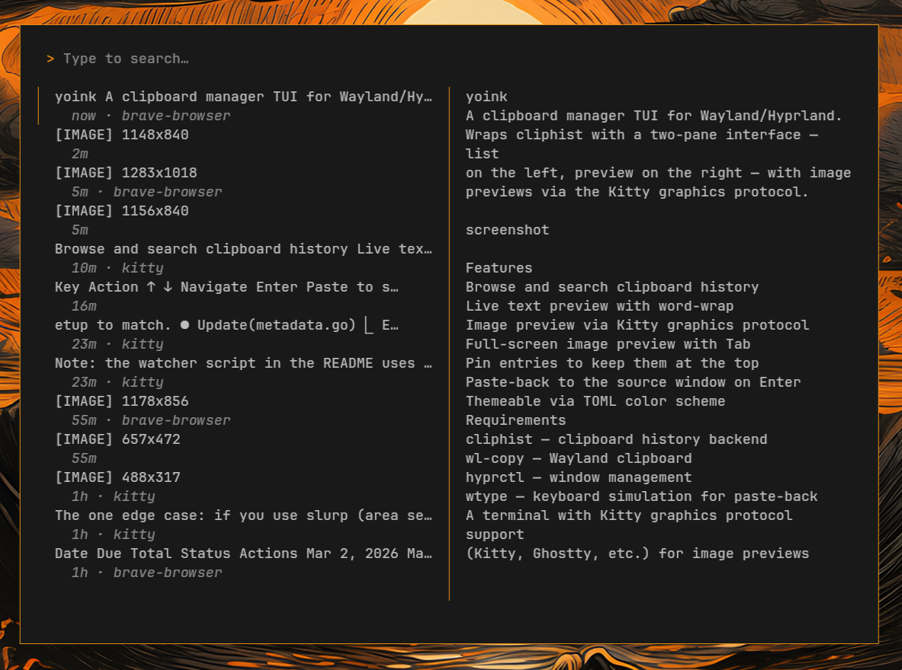
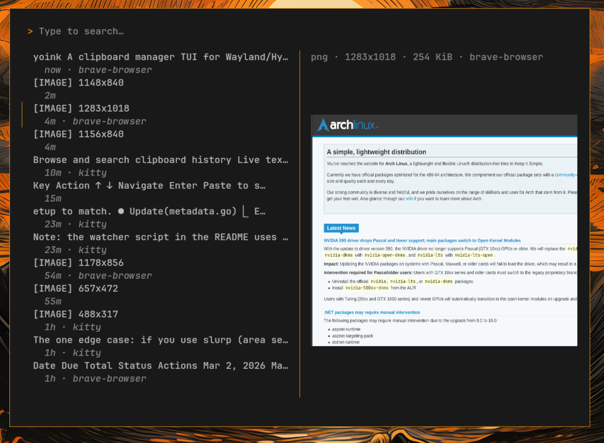
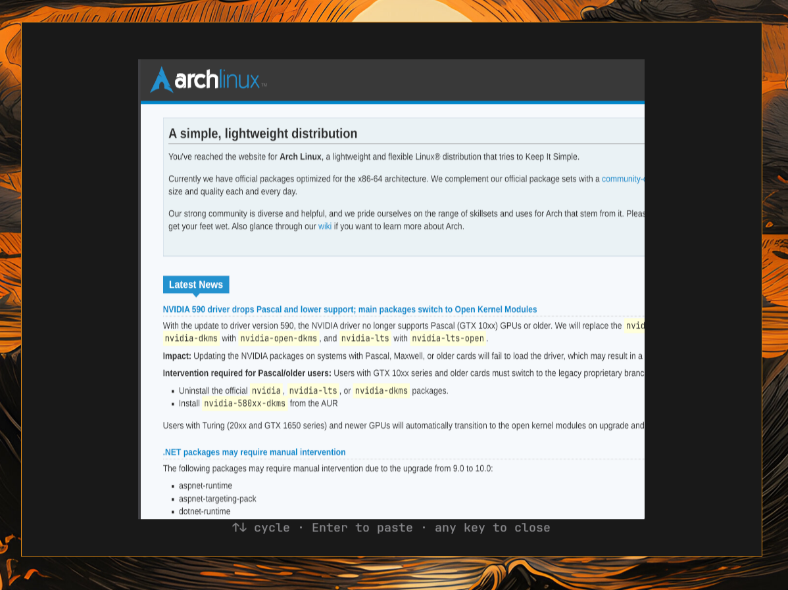

# yoink

A clipboard manager TUI for Wayland/Hyprland. Wraps [cliphist](https://github.com/sentriz/cliphist) with a two-pane interface — list on the left, preview on the right — with image previews via the Kitty graphics protocol.

<p>
  
  
  
</p>

## Features

- Browse and search clipboard history
- Live text preview with word-wrap
- Image preview via Kitty graphics protocol
- Full-screen image preview with Tab
- Pin entries to keep them at the top
- Paste-back to the source window on Enter
- Themeable via TOML color scheme

## Requirements

- [cliphist](https://github.com/sentriz/cliphist) — clipboard history backend
- [wl-copy](https://github.com/bugaevc/wl-clipboard) — Wayland clipboard
- [hyprctl](https://wiki.hyprland.org/) — window management
- [wtype](https://github.com/atx/wtype) — keyboard simulation for paste-back
- A terminal with [Kitty graphics protocol](https://sw.kovidgoyal.net/kitty/graphics-protocol/) support (Kitty, Ghostty, etc.) for image previews

## Install

```bash
go install github.com/fjordnode/yoink@latest
```

Or clone and build manually:

```bash
git clone https://github.com/fjordnode/yoink.git
cd yoink
make install  # builds and copies to ~/.local/bin/
```

## Keybindings

| Key | Action |
|-----|--------|
| `↑` `↓` | Navigate |
| `Enter` | Paste to source window |
| `Ctrl+Y` | Copy to clipboard |
| `Ctrl+D` | Delete entry |
| `Ctrl+P` | Pin/unpin entry |
| `Tab` | Full-screen image preview |
| `Esc` | Quit (or clear search) |
| Type anything | Search/filter |

## Source app tracking (optional)

The TUI can display which app each entry was copied from. This requires a small watcher script that runs alongside cliphist.

Create `~/.local/bin/yoink-watcher`:

```bash
#!/bin/bash
# Captures the active window class when clipboard changes
# and writes it to the clipboard metadata store.

METADATA="$HOME/.local/share/yoink/metadata.json"
SELF_CLASS="yoink"

# Get active window class
class=$(hyprctl activewindow -j 2>/dev/null | jq -r '.class // empty')
[ -z "$class" ] && exit 0
[ "$class" = "$SELF_CLASS" ] && exit 0

# Wait for cliphist to store the entry (up to 500ms)
latest=""
for i in $(seq 1 25); do
  latest=$(cliphist list | head -1)
  [ -n "$latest" ] && break
  sleep 0.02
done
[ -z "$latest" ] && exit 0

id=$(echo "$latest" | cut -f1)

# Ensure metadata file exists
mkdir -p "$(dirname "$METADATA")"
[ -f "$METADATA" ] || echo '{"entries":{}}' > "$METADATA"

# Write source if not already set
existing=$(jq -r --arg id "$id" '.entries[$id].source // empty' "$METADATA" 2>/dev/null)
if [ -z "$existing" ]; then
  jq --arg id "$id" --arg src "$class" \
    '.entries[$id].source = $src' "$METADATA" > "$METADATA.tmp" && \
    mv "$METADATA.tmp" "$METADATA"
fi
```

Then add to your Hyprland autostart:

```
exec-once = wl-paste --watch yoink-watcher
```

## License

MIT
